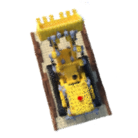
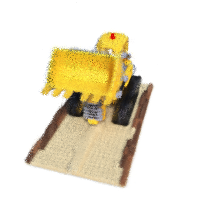
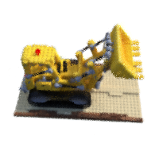
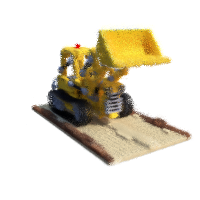
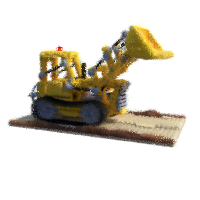
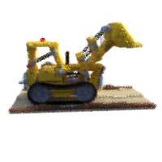
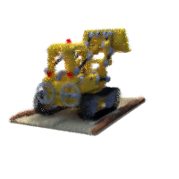
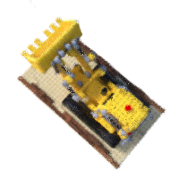
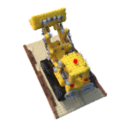
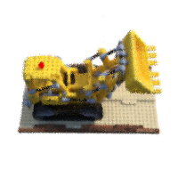

# A very minimal implementation of NeRF
- Trained on 4x downsampled images
- No view directions, only using XYZ
- Only one network, no coarse/fine

Results after 70k iterations

<table>
  <tr>
    <td></td>
    <td></td>
    <td></td>
    <td></td>
    <td></td>
  </tr>
  <tr>
    <td></td>
    <td></td>
    <td></td>
    <td></td>
    <td></td>
  </tr>
</table>
